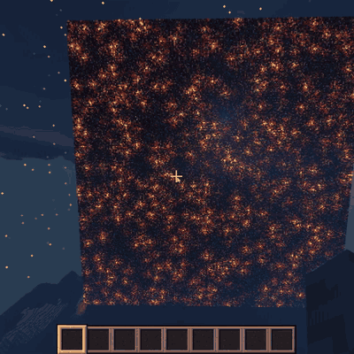

# mafs — Minecraft as file storage

A Spigot plugin that stores files in a Minecraft world. Every byte of a file becomes a block, and the blocks can be read back into the original file.



## How it works

- Each of the 256 possible byte values maps to a distinct block (see `MATERIALS` in [`Constants.java`](src/main/java/com/mafs/helper/Constants.java)). Blocks that fall, spread, oxidize, or otherwise change on their own are left out so a structure decodes the same way later.
- `/encode` builds the structure 5 blocks east (+X) of the block you're standing on. Blocks fill a 16×16 layer, layers stack up to 256 high (or the world's build limit, whichever is lower), and then a new column starts 16 blocks south (+Z).
- A beacon is placed after the last data block to mark the end of the file.
- `/decode` reads the blocks back from the same position until it reaches the beacon and writes the bytes to a file.

## Commands

| Command | Description |
| --- | --- |
| `/encode <filename>` | Encodes `files/<filename>` into blocks in front of you. |
| `/decode <filename>` | Decodes the structure in front of you into `files/<filename>`. |

`files` is a directory next to where the server is running. Filenames can't point outside of it, and `/decode` won't overwrite an existing file.

To decode a file, stand on the same block you were on when you encoded it. `/encode` tells you the coordinates.

## Building

Requires Java 21 and Maven. The build output directory is set with `-Ddir`:

```sh
mvn package -Ddir=target
```

Copy the jar from `target/` into your server's `plugins` directory. The plugin targets Spigot API 1.20.

## Tests

```sh
mvn test -Ddir=target
```

## Limitations

- Encoding overwrites whatever blocks are already in the structure's space.
- Encoding and decoding run on the main server thread, so large files will lag the server.
- Breaking or replacing a block in the structure corrupts the file.
